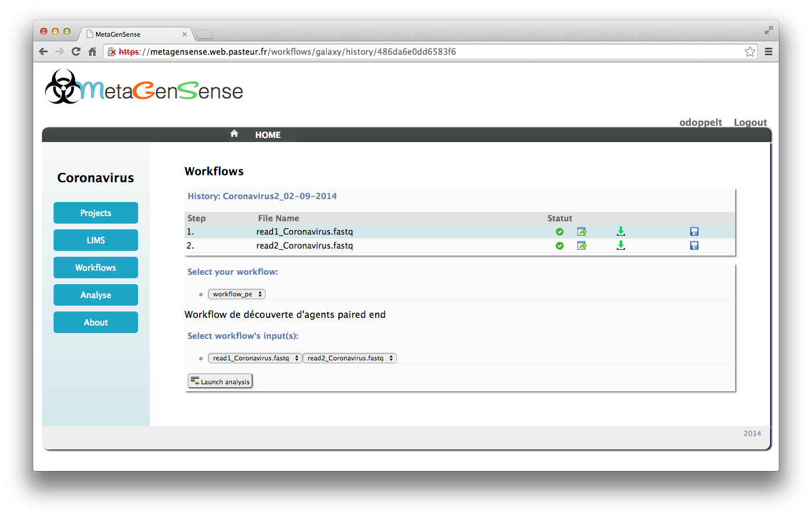

Launch workflow
===============

1. Select Workflow
------------------

Choose a specific workflow. 

Remark: the workflow list is filled by the MetaGenSense (Django) administrators, .

2. Select Input
---------------

Select inputs available in the history according to the chosen workflow input format.  

3. Launch analyse
-----------------

After that, click on "launch analysis" to execute the workflow.
