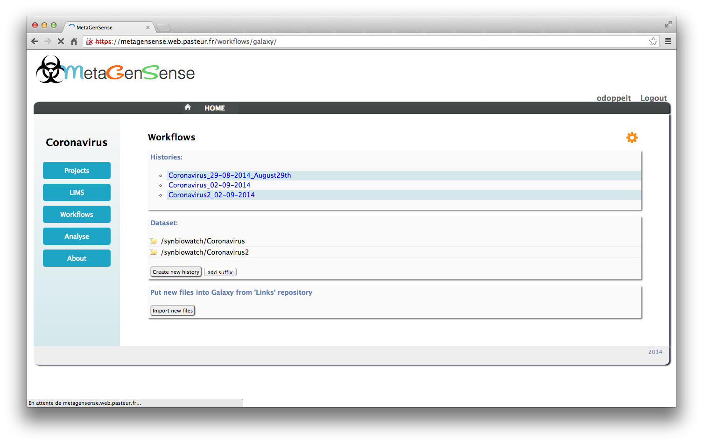

Load data
=========

Import data in the galaxy library
---------------------------------

New data to analyse must stored in the project directory (cf :doc:`input` )
Data are copied within the user’s Galaxy library when he clicks on the “import new files” button

Files loaded are now available to create analyze histories 

Create new history
------------------

The files to analyze become datasets which will be copied within a galaxy history:

1 - Select files

2 - Click on the “create new history” button.

By default project name and date are used to create the new history name, user can add a suffix to custom this name.

If a new history is created, user is redirected to an other page where he will be invited to select a workflow.

